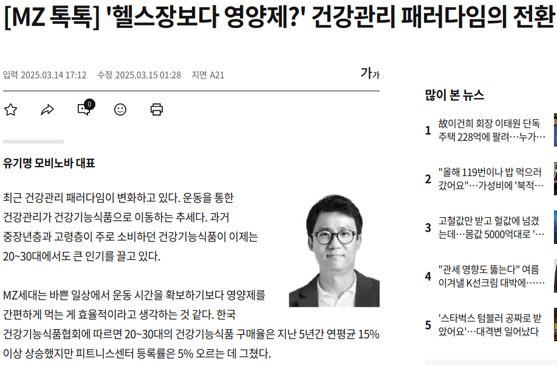

# 🌟TEAM: 조은지안조은지

 

## 🚀프로젝트 개요
**Ai Nutri View**는 웹캠으로 얼굴을 인식해 나이와 성별을 추론하고, 개인에 맞는 영양제를 AI가 추천하는 스마트 헬스케어 시스템입니다.
이 프로젝트는 딥러닝 기반 얼굴 분석 모델과 LLM(Ollama:1b)을 활용하여, 사용자의 정보를 바탕으로 하루 권장량과 추천 이유까지 제공하는 개인 맞춤형 영양제 가이드를 목표로 합니다.  

❗추가적으로 **CPU 기반 환경(PC, Raspberry Pi)** 뿐만 아니라 FPGA 기반의 AI 가속기 환경에서도 실험되었으며, 이를 통해 연산 처리 속도 및 전력 효율 측면에서의 최적화를 시도하였습니다.
특히 **Xilinx Ultra96-V2 FPGA 보드에 DPU(Deep Processing Unit)**를 탑재하고, **Vitis-AI 플랫폼**을 활용해 학습된 딥러닝 모델을 **.xmodel로 변환**함으로써, FPGA 보드 상에서의 실시간 얼굴 추론을 가능하게 하였습니다. 

🎉 ResNet-50 모델을 기준으로 한 성능 비교 결과, FPGA의 DPU 환경에서 **약 36배 빠른 추론 속도**를 기록하며, **PC 기반보다 에너지 효율성과 응답 시간 측면**에서 유의미한 성능 향상을 보였습니다. 

### 🧐문제 인식
현대인은 바쁜 일상 속에서 자신에게 맞는 영양제를 찾기 어렵고, 정보는 넘쳐나지만 정확한 추천은 부족한 실정입니다. 특히 성별, 연령, 건강 상태 등에 따라 필요한 영양소가 다르지만 이를 고려하지 않은 제품 선택은 오히려 건강을 해칠 수 있습니다.
이에 따라 **Ai Nutri View**는 웹캠으로 실시간 얼굴을 인식하여 추론된 나이와 성별 정보를 기반으로, 사용자에게 꼭 필요한 영양제 3가지를 하루 섭취량과 함께 추천함으로써 보다 정확하고 안전한 건강 관리 서비스를 제공하고자 개발되었습니다.

## 🙋‍♂️팀원
- 조장: 정은지
- 팀원1: 장환
- 팀원2: 이은성
- 팀원3: 최현우

## 🖊️Role
- 정은지
  - Team leader
- 이은성
  - S/W 개발
  - AI 모델 통합 (+알고리즘 개선)
  - 라즈베리파이 임베딩
    - Application developer(Raspberry PI)
  
- 장환
  - Validation
  - 나이 구간 정확도 검증
  - 성별 분류 정확도 검증
  - 웹캠 처리 속도 검증
- 최현우
  - FPGA & On-device developer
  - 나이 및 성별 추론 모델 학습
    - 라즈베리파이 임베딩 및 성능 개선
  - Ultra96V2에 추론 모델 포팅
  - PYNQ OS importing
  - PS - PL에 따른 성능 비교
  - FPGA vs Raspberry PI 성능 비교

## 🗓️개발 일정

### <개발일정 기재 - Gantt Chart>

|                        |  7/1  |  7/2  |  7/3  |  7/4  |  7/5  |  7/6  |  7/7  |  7/8  |  7/9  | 7/10  |
| :--------------------- | :---: | :---: | :---: | :---: | :---: | :---: | :---: | :---: | :---: | :---: |
| 주제 선정              |   O   |       |       |       |       |       |       |       |       |       |
| 역할 분담              |   O   |       |       |       |       |       |       |       |       |       |
| 아이디어 제시          |   O   |   O   |       |       |       |       |       |       |       |       |
| 추론 모델 학습         |       |   O   |   O   |   O   |       |       |       |       |       |       |
| 추론 모델 개발 (PC)    |       |       |       |       |   O   |   O   |   O   |       |       |       |
| 라즈베리파이 임베딩    |       |       |       |       |       |       |   O   |   O   |       |       |
| FPGA 추론 모델 포팅    |       |       |       |       |   O   |   O   |   O   |   O   |       |       |
| FPGA-PS 추론 모델 제작 |       |       |       |       |       |       |       |   O   |   O   |   O   |
| 발표 자료 제작         |       |       |       |       |       |       |       |       |   O   |   O   |

### 0703~0704

#### 최현우

- 나이 학습 모델 개발및 추론 검증 병행
    - EfficientNet B7모델 학습
    - EfficientNet B7(Teacher) → B3(Student) 전이학습(경량화)
    - Gil Levi & Tal Hassner Model 레퍼런스 모델 참조
       - 라즈베리 파이 임베딩 후 성능 확인
       - 기존 학습 모델은 특정 나이대만 추론됨
       - 레퍼런스 모델 사용시 다양한 나이대 추론 성공
    - 추론 모델 경량화 연구
       - Caffe → onnx → tensorflow 파일로 convert 수행
- FPGA이용 가속화 방법 연구
    - DPU IP를 사용하여 petalinux 이미지 bake 방안 모색
    - Vitis-AI 플랫폼
       - 학습 결과 파일 → .xmodel로 변환
       - DPU에 모델을 최적화하기 위해 양자화 및 컴파일
       - DPU IP에 최적화된 파일 생성
    - PYNQ OS
       - pynq-dpu를 이용하여 PYNQ OS에 내장된 DPU IP 사용가능
       - PYNQ-OS의 pynq-dpu와 VART를 사용하여 DPU를 이용한 추론

→ Vitis-AI 플랫폼을 이용한 .xmodel 우선 시도

### 0705-0706

#### 최현우

[07/05]

Ultra96 V2: Vitis-AI를 활용한 xmodel 생성 시도
- darknet yolov3의 weights 및 cfg를 caffe 형식으로 변환 시도
- Vitis-ai에서 지원하는 caffe 버전이 convert 스크립트의 concat 주변 레이어 구성 지원을 하지 않음
- tensorflow 형식으로 변환 시도
- yolov3-tiny모델의 weight와 cfg 파일의 불일치 문제
  - 해당 문제로 시간 지체
- yolov3의 weight와 cfg로 변환 시도
- frozen_graph.pb 파일 생성 완료
  - 최종 양자화 단계에서 .xmodel 파일 생성 오류
  - Segmentation fault 발생
  - calibration data 및 GPU 자원 off 시도
  - 그럼에도 해결 X

[07/06]

- PYNQ OS으로 해결 시도
- DPU 사용을 위한 .xmodel 생성 시도 실패
- PYNQ OS를 사용하여 Vitis-ai가 지원하는 pynq-dpu 사용 시도
- Ultra96v2에 DPU import 성공
- Yolov3를 이용한 이미지 객체 분류 성공
- 웹캠을 이용한 실시간 객체 분류 시도
  - PYNQ OS 모니터 출력과 웹캠 모니터 출력이 겹쳐 모니 송출 문제 발생
  - HW overlay에서 해당 DP 출력 IP를 찾아 웹캠 구동 시 xwindow 종료로 설정
  - 웹캠 구동은 성공했으나 카메라 송출 속도가 너무 느림
  - 이미지로 성능 비교하기로 방향 전환
- PS(ap)로만 사용했을 때와 PL(DPU)을 같이 사용했을 때 이미지 객체 분류에서 성능 비교 성공

### 0707

#### 최현우

- Daily Report 및 Git README 중간 정리
-  PYNQ OS ResNET50 .xmodel 생성
    - MLPerf 최적화 ResNET50 모델에 대한 xmodel 파일 생성
    - MLPerf: 머신러닝 성능 측정을 위한 벤치마크 → 최적화가 가장 잘된 모델
    - DPU의 퍼포먼스를 확인하기에 가장 최적의 모델이라 판단
- ResNET50에 대한 Class 분류 코드 작성
    - pynq-dpu를 사용하는 스크립트
    - PS만을 사용하는 스크립트
       - PS에 대한 스크립트는 모델 파일 필요
       - TF 혹은 PT에서 사전학습된 파일 사용 예정
       - Pynq에서 구동 불가 시 코랩을 통한 직접 모델 파일 생성할 것
- FPGA와 라즈베리파이 간 성능 비교를 위한 Test Sample 데이터 준비

### 0708

#### 최현우

- ResNet50 DPU 사용했을 때 성능 비교
   - PYNQ-DPU ResNet50 .xmodel생성
   - DPU 사용 시 및 PS만 사용할 때 성능 측정
   - 우분투 PC 및 라즈베리 파이에서 성능 측정
[비교 결과]
ResNet50: https://github.com/drgn88/ai_age_body_tablet_team4/issues/2
YoloV3: https://github.com/drgn88/ai_age_body_tablet_team4/issues/3

### 0709

### 0710

## 🚀Trouble Shooting

### 이은성

### 장환

### 정은지

### 최현우
