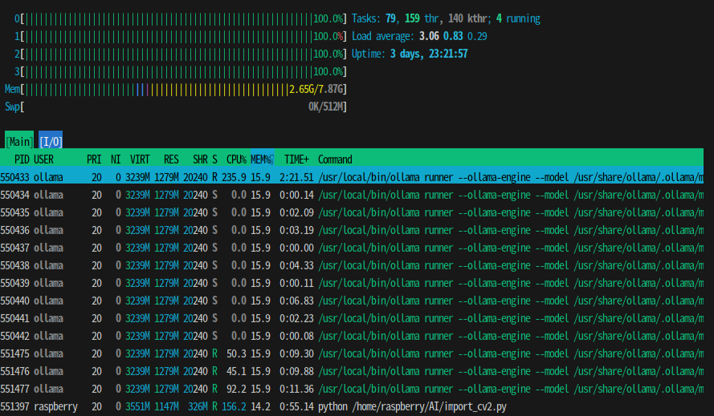

# 🚀Trouble Shooting - Integrated System

## 문제 인지
- Raspberry PI에서 모델 추론 지연
    - PC에서는 동작했던 시스템이 Raspberry PI에서 동작하지 않는 문제가 발생

## 원인 파악
- htop 명령어를 통해 프로세서 리소스 사용량을 확인

| 리소스 사용량 |
| :---: |
||

- → 초당 1회만 추론하도록 제한했음에도 불구하고, 웹캠과 Ollama를 동시에 실행하면 모든 CPU 코어가 사용되어 성능 저하 및 시스템 불안정 문제가 발생함.

- ❗최적화 필요

## 문제 해결
- Ollama가 답변을 준비하고 있을 때 웹캠을 닫았다가 답변이 완료되었을 때 다시 웹캠을 여는 방법을 고안

```py
while True:
    start = time.time() # 프레임 처리 시작 시간 기록

    # 웹캠 닫기 요청 처리 
    with webcam_status_lock:
        if webcam_needs_closure:
            if cap and cap.isOpened():
                cap.release()
                print("웹캠 일시 정지.")
            webcam_needs_closure = False # 웹캠 닫기 완료
            # 웹캠이 닫혔을 때 프레임에서 이미지 처리를 하지 않음
            black_frame = np.zeros((480, 640, 3), dtype=np.uint8)
            cv2.imshow("Age & Gender Prediction (raspberrypi에서)", black_frame)
            key = cv2.waitKey(delay) & 0xFF # 키 입력 대기
            continue # 다음 루프 반복으로 넘어가서 웹캠 재개 대기

    # 웹캠 열기 요청 처리
    with webcam_status_lock:
        if webcam_needs_reopen:
            if not (cap and cap.isOpened()): 
                cap = cv2.VideoCapture(0)
                cap.set(cv2.CAP_PROP_FRAME_WIDTH, 640)
                cap.set(cv2.CAP_PROP_FRAME_HEIGHT, 480)

                if not cap.isOpened():
                    print("❌ 웹캠 다시 열기 실패. 재시도합니다.")
                    # 실패 시에도 재시도 플래그를 해제하여 루프가 계속 돌게 함
                    webcam_needs_reopen = False 
                    # 웹캠이 열린상태가 아니면 이미지 처리를 하지 않음
                    black_frame = np.zeros((480, 640, 3), dtype=np.uint8)
                    cv2.putText(black_frame, "웹캠 열기 실패...", (100, 240),
                                cv2.FONT_HERSHEY_SIMPLEX, 1, (255, 255, 255), 2)
                    cv2.imshow("Age & Gender Prediction (raspberrypi에서)", black_frame)
                    key = cv2.waitKey(delay) & 0xFF # 키 입력 대기
                    continue
                else:
                    print("웹캠 재개.")
            webcam_needs_reopen = False # 열기 요청 처리 완료
            # 웹캠 열렸으니 다음 루프에서 바로 프레임을 읽도록 함
            continue 

    # 웹캠이 열려있을 때만 프레임을 읽고 처리
    if cap and cap.isOpened():
        ret, frame = cap.read()
        if not ret:
            print("프레임을 읽을 수 없습니다. 웹캠 연결을 확인하세요. 프로그램 종료.")
            break
```

